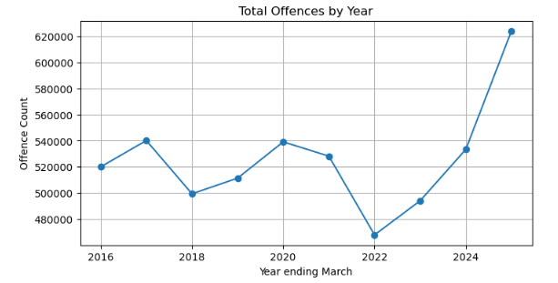
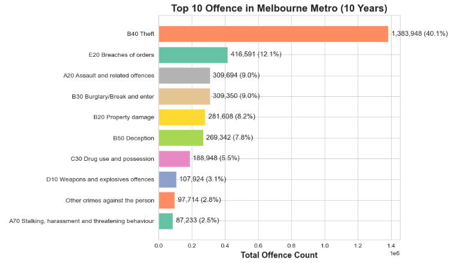
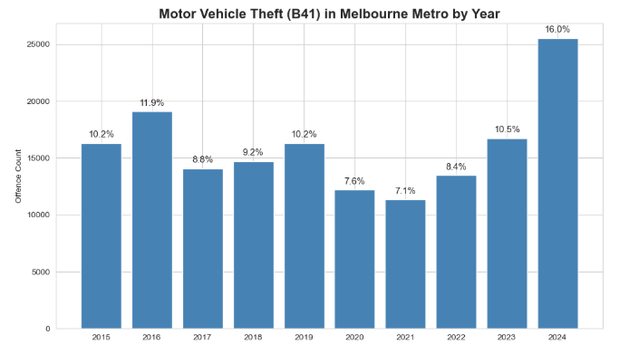
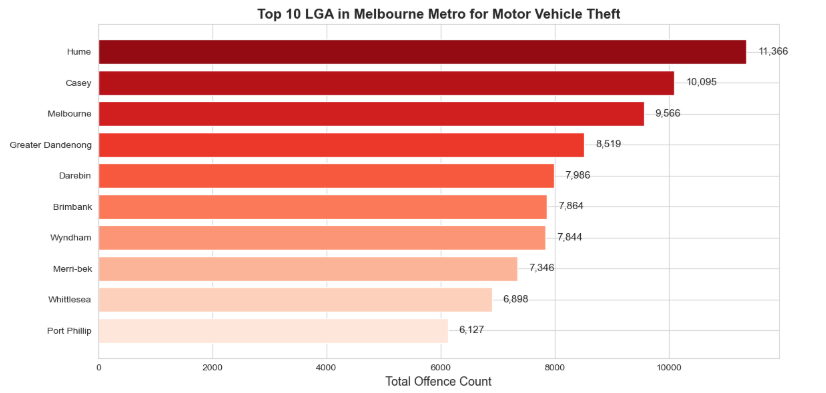
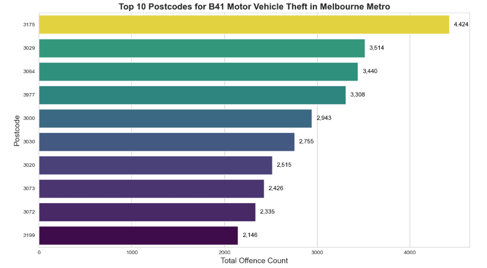

# 🚔 Melbourne Crime Analysis: Motor Vehicle Theft (2016-2025)

Comprehensive analysis of motor vehicle theft patterns in Melbourne using 10 years of crime statistics from Victoria Police.

---

## 📊 Key Findings

- **52% spike** in motor vehicle thefts (2023-2024): from 16,748 → 25,549 incidents
- **70%+ unsolved rate** across all years
- **Street parking = 34%** of all thefts (45,654 incidents)
- **Top hotspots:** Hume (11,366), Casey (10,095), Melbourne CBD (9,566)
- **Males: 75%** of alleged offenders; peak age 25-29 years

---

## 🗂️ Datasets

Three Victoria Police Crime Statistics datasets (500K+ records):

1. **LGA Dataset** (367,203 records) - Geographic & temporal trends
2. **Criminal Incidents** (134,000+ B41 incidents) - Location types & charge status
3. **Alleged Offenders** - Demographics (gender, age)

### Data Access

⚠️ **Data files NOT included** (100MB+ total)

**Download from:** [Victoria Police Crime Statistics](https://www.crimestatistics.vic.gov.au)

Files needed:
- `Data_Tables_LGA2025.xlsx`
- `Data_Tables_Criminal_Incidents2025.xlsx`
- `Data_Tables_Alleged_Offender2025.xlsx`

Place in `data/raw/` folder

---

## 🛠️ Technologies

- Python 3.9+
- Pandas, NumPy
- Matplotlib, Seaborn
- Folium (interactive maps)
- Jupyter Notebook

---

## 🚀 Setup

```bash
# Clone repository
git clone https://github.com/matthewphilip-quantlab/melbourne-crime-analysis.git
cd melbourne-crime-analysis

# Install dependencies
pip install -r requirements.txt

# Download data (see above)
# Place in data/raw/

# Run notebook
jupyter notebook
```

---

## 📈 Analysis Overview

### Temporal Analysis
- COVID-19 impact: 24% drop (2020-2021)
- Post-pandemic surge: 52% increase (2024)
- Consistent 70% unsolved rate

### Geographic Patterns
- Melbourne Metro accounts for majority
- Outer suburbs (Hume, Casey, Dandenong) highest
- Custom region mapping: 79 LGA → 12 regions

### Location Analysis
- Street/footpath: 34% (most vulnerable)
- Residential driveways: 13%
- Single-level carparks: 7%

### Demographics
- Gender: 75% male, 25% female
- Age peak: 25-29 years (16.3%)
- Youth crime: 17.2% under 18

---

## 🗺️ Visualizations

### 📈 Total Offences by Year (2016–2025)


> All-time high in 2025 with **623,953 offences** — sharp rebound after the 2021 COVID low of 467,941.

---

### 🏆 Top 10 Offence Types in Melbourne Metro (10 Years)


> **B40 Theft dominates at 40.1%** (1,383,948 incidents), followed by Breaches of Orders (12.1%) and Assault (9.0%).

---

### 🚗 Motor Vehicle Theft (B41) by Year


> Peaked at **16.0% share in 2024** after a low of 7.1% in 2021. Consistent upward trend from 2022.

---

### 🗺️ Top 10 LGA for Motor Vehicle Theft


> **Hume (11,366)**, Casey (10,095), and Melbourne CBD (9,566) are the highest-risk LGAs.

---

### 📮 Top 10 Postcodes for Motor Vehicle Theft


> **Postcode 3175 leads with 4,424 incidents** — covering Dandenong, one of Melbourne's highest-density suburban corridors.

---

## ⚠️ Ethical Considerations

### Limitations
- Alleged offenders ≠ convicted criminals
- Reporting bias exists
- No socioeconomic context
- Aggregated data only

### Intended Use
✅ Understanding crime patterns  
✅ Public awareness  
✅ Academic research  

❌ NOT for individual profiling  
❌ NOT for discriminatory practices  

---

## 📂 Project Structure

melbourne-crime-analysis/
├── README.md
├── requirements.txt
├── .gitignore
├── [your-notebook].ipynb
├── data/
│   └── raw/          # Download datasets here
└── outputs/
├── figures/
└── maps/

---

## 📝 License

MIT License

Data: Victoria Police Crime Statistics (subject to their terms of use)

---

## 👤 Author

**Philip Matthew**

- GitHub: [@matthewphilip-quantlab](https://github.com/matthewphilip-quantlab)
- LinkedIn: [Philip Matthew](https://www.linkedin.com/in/philip-matthew-514703341/)
- Email: matthewphilip788@gmail.com

---

## 🙏 Acknowledgments

- Victoria Police for providing open crime statistics
- Melbourne metropolitan community for the context
- Python data science community for excellent tools

---

⭐ **If you found this useful, please star the repo!**

*Last updated: July 1, 2026*
